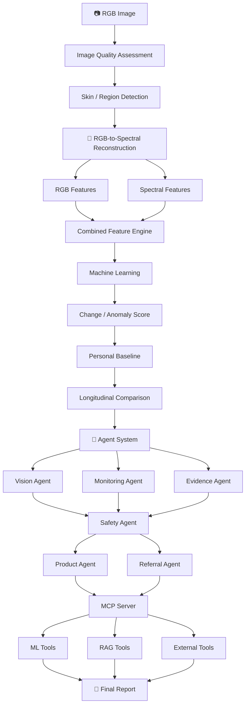

<a id="readme-top"></a>

<div align="center">

# 🔬 SpectraDerm

### AI-Powered Early Warning & Skin Monitoring Using RGB-to-Spectral Reconstruction, Multimodal Analysis & Evidence-Grounded Multi-Agent AI

<p>
  <strong>Turn an ordinary smartphone image into an AI-assisted longitudinal skin-monitoring workflow.</strong>
</p>

<p>
  <a href="#-overview">Overview</a> •
  <a href="#-key-features">Features</a> •
  <a href="#-architecture">Architecture</a> •
  <a href="#-how-it-works">How It Works</a> •
  <a href="#-installation">Installation</a> •
  <a href="#-testing">Testing</a>
</p>

<br/>


</div>

---

> [!IMPORTANT]
> **SpectraDerm is a monitoring and awareness prototype, not a diagnostic system.**
>
> It does not diagnose skin diseases, provide disease probabilities, or replace professional dermatological assessment. The spectral information generated by the system is **AI-estimated**, not a physical multispectral or hyperspectral measurement.

---

## 🎥 Demo

SpectraDerm demonstrates a complete end-to-end workflow:

**RGB Image → Quality Assessment → Spectral Reconstruction → Feature Extraction → ML Analysis → Personal Baseline → Longitudinal Comparison → RAG Explanation → Safety Assessment → Next Action**

### Demo Video

<video src="YOUR_GITHUB_VIDEO_URL" controls width="100%"></video>

https://github.com/user-attachments/assets/989945d0-4a8f-4e28-9901-5f447ba61b9e

### 📸 Screenshots

Add project screenshots here to showcase the major parts of the application.

| Home | Scan & Analysis |
|---|---|
| `docs/assets/home.png` | `docs/assets/analysis.png` |

| Spectral Visualization | Monitoring Result |
|---|---|
| `docs/assets/spectral.png` | `docs/assets/result.png` |

| History / Timeline | AI Explanation |
|---|---|
| `docs/assets/history.png` | `docs/assets/explanation.png` |

---

# 🌟 Overview

SpectraDerm is an AI-powered skin monitoring prototype designed to help users observe **subtle changes in their skin over time using ordinary RGB images**.

Traditional smartphone photographs are accessible and convenient, but they capture only RGB information. Specialized multispectral or hyperspectral imaging can provide richer optical information, but such hardware is expensive and impractical for everyday personal monitoring.

SpectraDerm explores a different approach:

> **Can AI-estimated spectral information reconstructed from an ordinary RGB image provide useful additional signals for longitudinal skin monitoring?**

The system combines:

- 📷 RGB image analysis
- 🌈 AI-estimated spectral reconstruction
- 🧬 Multimodal feature extraction
- 🤖 Machine learning
- 👤 Personal skin baselines
- 📈 Longitudinal scan comparison
- 📚 Retrieval-Augmented Generation (RAG)
- 🧠 Multi-agent AI
- 🔌 Model Context Protocol (MCP)
- 👨‍⚕️ Dermatologist referral
- 🧴 General OTC skincare-category guidance
- 📄 Structured monitoring reports

The project is implemented as an **AI/ML capstone prototype** rather than a clinically validated medical device.

---

# 🎯 Problem

People often struggle to notice gradual or subtle changes in their skin through casual visual comparison.

At the same time:

**RGB photography**

- is inexpensive,
- is widely accessible,
- works with ordinary smartphones,

but provides limited optical information.

**Multispectral / hyperspectral imaging**

- captures richer spectral information,
- can provide additional optical signals,

but requires specialized imaging hardware that is not practical for everyday personal use.

SpectraDerm explores whether AI can help bridge this accessibility gap by estimating additional spectral information from ordinary RGB images and combining it with a person's previous scans.

---

# 💡 The SpectraDerm Approach

```text
                    ORDINARY RGB IMAGE
                           │
                           ▼
                  Image Quality Check
                           │
                           ▼
                  Skin / Region Detection
                           │
                           ▼
             RGB-to-Spectral Reconstruction
                           │
                           ▼
              AI-Estimated Spectral Image
                           │
              ┌────────────┴────────────┐
              ▼                         ▼
        RGB Features              Spectral Features
              │                         │
              └────────────┬────────────┘
                           ▼
                    Feature Engine
                           │
                           ▼
                    ML Analysis
                           │
                           ▼
                 Change / Anomaly Score
                           │
                           ▼
                 Personal Baseline
                           │
                           ▼
                Longitudinal Comparison
                           │
                           ▼
                    Agent System
                           │
              ┌────────────┼────────────┐
              ▼            ▼            ▼
           Vision      Monitoring     Evidence
           Agent         Agent          Agent
              └────────────┼────────────┘
                           ▼
                     Safety Agent
                       /       \
                      ▼         ▼
                  Product    Referral
                   Agent       Agent
                      \         /
                       \       /
                        ▼     ▼
                       MCP Server
                           │
                           ▼
                     Final Report
```

---

# ✨ Key Features

## 📷 1. RGB Image Analysis

Users can upload or capture an ordinary skin image.

Before analysis, the system evaluates image quality including factors such as:

- Blur
- Exposure
- Lighting
- Framing
- Resolution

Poor-quality images can be rejected or flagged for retaking.

---

## 🔍 2. Skin & Region Detection

SpectraDerm identifies the relevant skin region and, where applicable, a specific region of interest for longitudinal comparison.

This helps ensure that later scans focus on a comparable area rather than comparing unrelated parts of an image.

---

## 🌈 3. RGB-to-Spectral Reconstruction

This is one of SpectraDerm's core components.

The system takes:

```text
RGB Image
H × W × 3
```

and generates:

```text
Estimated Spectral Image
H × W × N
```

Conceptually:

```text
RGB
 │
 ▼
Spectral Reconstruction Model
 │
 ▼
AI-Estimated Spectral Representation
```

The reconstructed information is then used as an additional source of features.

> **Important:** SpectraDerm does not claim that the generated output is an actual NIR, multispectral, or hyperspectral image. It is a model-estimated spectral representation.

---

## 🧬 4. Multimodal Feature Extraction

SpectraDerm combines information from multiple feature groups.

### RGB Features

Examples include:

- Color statistics
- Texture
- Shape
- Local contrast
- Pigmentation-related characteristics

### Spectral Features

Examples include:

- Band-wise intensity
- Spectral ratios
- Spectral differences
- Regional spectral statistics
- Spectral signatures

### Temporal Features

Historical scan information is incorporated to support longitudinal monitoring.

These features are combined into a unified representation for downstream analysis.

---

# 📊 5. RGB vs RGB + Spectral Experiment

A key part of SpectraDerm is that the project does **not simply assume that spectral reconstruction improves analysis**.

Instead, the system can compare:

```text
                    RGB IMAGE
                       │
             ┌─────────┴─────────┐
             ▼                   ▼
        RGB Features       Spectral Reconstruction
             │                   │
             │                   ▼
             │            Spectral Features
             │                   │
             └─────────┬─────────┘
                       │
             ┌─────────┴─────────┐
             ▼                   ▼
       RGB-Only Model       RGB + Spectral Model
             │                   │
             └─────────┬─────────┘
                       ▼
                 Performance
                  Comparison
```

The RGB-only representation acts as a baseline, while the combined representation tests whether estimated spectral information provides useful additional signal.

---

# ⚠️ 6. Change / Anomaly Detection

The machine-learning pipeline produces a **model-derived change/anomaly score**.

For example:

```text
Change / Anomaly Score
        72 / 100
```

The score represents deviation from a relevant reference pattern.

It does **not** mean:

```text
72% probability of disease
```

Instead:

```text
Stable
   ↓
Monitor
   ↓
Higher Change
```

The score is intended as an early-warning / monitoring signal rather than a medical diagnosis.

---

# 👤 7. Personal Baseline

Instead of assuming that every person's skin should look the same, SpectraDerm establishes a **personal reference baseline**.

### First Scan

```text
First Scan
    │
    ▼
RGB + Estimated Spectrum
    │
    ▼
Personal Baseline
```

### Later Scans

```text
Current Scan
      +
Personal Baseline
      │
      ▼
Difference Analysis
      │
      ▼
Stable / Changed / Increasing Change
```

This makes longitudinal monitoring personalized rather than relying only on a generic population reference.

---

# 📈 8. Longitudinal Monitoring

SpectraDerm stores scan history so changes can be evaluated across time.

Example:

```text
May        June        July        August
 ●          ●           ●            ●
 │          │           │            │
Stable    Stable     Slight       Increased
                     Change        Change
```

A difference map can also be used to highlight regions where model-derived changes are observed.

The system distinguishes between:

- Baseline establishment
- Change from baseline
- Longitudinal patterns

A meaningful trend requires multiple comparisons rather than relying on a single scan.

---

# 📚 9. Retrieval-Augmented Generation (RAG)

When the user asks:

> **"Why was this flagged?"**

SpectraDerm does not rely solely on free-form model generation.

Instead, relevant dermatology information is retrieved from a curated knowledge base.

### RAG Pipeline

```text
Knowledge Documents
        │
        ▼
     Cleaning
        │
        ▼
     Chunking
        │
        ▼
    Embeddings
        │
        ▼
   Vector Storage
        │
        ▼
 Semantic Retrieval
        │
        ▼
 Relevant Evidence
        │
        ▼
 Evidence-Grounded Explanation
```

The knowledge base can cover areas such as:

- General dermatology
- Skin pigmentation
- Melanin
- Hemoglobin / vascular characteristics
- Common skin conditions
- Warning signs
- Situations where professional assessment may be appropriate

### Semantic Similarity

The retrieval layer converts document chunks and user queries into embeddings and compares their semantic similarity to identify relevant evidence.

---

# 🧠 10. Multi-Agent AI

Instead of assigning every task to one agent, SpectraDerm separates responsibilities.

| Agent | Responsibility |
|---|---|
| 👁️ **Vision Agent** | Interprets image, spectral, feature and ML outputs |
| 📈 **Monitoring Agent** | Handles scan history, comparison and longitudinal trends |
| 📚 **Evidence Agent** | Performs RAG retrieval and evidence-grounded explanations |
| 🛡️ **Safety Agent** | Performs safety checks and determines appropriate next-step logic |
| 🧴 **Product Agent** | Provides general OTC skincare-category guidance when appropriate |
| 👨‍⚕️ **Referral Agent** | Helps surface dermatologist options |
| 🎛️ **Orchestrator Agent** | Coordinates the overall workflow |

This separation makes the system easier to develop, test and maintain.

---

# 🔌 11. Model Context Protocol (MCP)

SpectraDerm uses **Model Context Protocol (MCP)** as a standardized tool layer connecting the agents with application capabilities.

Example tools include:

```python
reconstruct_spectrum()
analyze_skin()
extract_features()
calculate_warning_score()
compare_scans()
retrieve_evidence()
get_skin_history()
find_dermatologists()
get_partner_products()
generate_report()
```

Conceptually:

```text
Agent
  │
  ▼
MCP Tool
  │
  ▼
Backend Capability
  │
  ▼
Result
  │
  ▼
Agent
```

This keeps tool access structured and separates agent reasoning from the underlying application functions.

---

# 🛡️ 12. Safety Layer

Healthcare-related AI requires safeguards.

The Safety Agent checks questions such as:

- Is the output being overstated?
- Is the system about to provide inappropriate medical advice?
- Should professional assessment be suggested?
- Is the detected change persistent or concerning?
- Should the system avoid product guidance and prioritize referral?

The system is designed around the principle:

```text
Model Observation
       ↓
Safety Assessment
       ↓
Appropriate Next Step
```

---

# 👨‍⚕️ 13. Dermatologist Referral

When the workflow indicates that professional assessment may be appropriate:

```text
Potentially Concerning Change
          ↓
     Safety Agent
          ↓
   Referral Agent
          ↓
Available Dermatologists
          ↓
Location / Relevant Information
          ↓
Professional Assessment Options
```

The referral component is intended to support access to professional care rather than replace it.

---

# 🧴 14. General Skincare Guidance

For situations where professional referral is not the appropriate next step, the Product Agent can provide **general OTC skincare-category guidance**.

Examples may include:

- Gentle cleansers
- Moisturizers
- Sunscreen

Product guidance is kept separate from the underlying ML detection process.

> **Commercial products do not determine the ML change/anomaly result.**

---

# 📄 15. Final Report

Rather than showing only a score, SpectraDerm combines multiple outputs into a structured report.

```text
Image Analysis
      +
Spectral Analysis
      +
ML Findings
      +
Historical Change
      +
RAG Evidence
      +
Safety Assessment
      +
Recommended Action
      │
      ▼
FINAL SPECTRADERM REPORT
```

The report can communicate:

- What the system observed
- Where the change was detected
- How the current scan compares with previous scans
- Why the system flagged the pattern
- Supporting evidence
- Appropriate next-step guidance

---

# 🏗️ Architecture

## End-to-End Architecture



---

# 🔄 How It Works

The complete user journey is:

```text
🏠 Home
   ↓
📷 Start Scan
   ↓
🖼️ Upload / Capture Image
   ↓
🔍 Image Quality Check
   ↓
🌈 Spectral Reconstruction
   ↓
🧬 Feature Extraction
   ↓
🤖 ML Analysis
   ↓
⚠️ Change / Monitoring Result
   ↓
📈 History & Baseline Comparison
   ↓
❓ Why Was This Flagged?
   ↓
📚 RAG Evidence
   ↓
🛡️ Safety Assessment
   ↓
👨‍⚕️ Referral / 🧴 General Guidance
   ↓
📄 Final Report
```

---

# 🧪 Data & AI Pipeline

## Dataset Roles

The project proposal defines dataset roles for different components:

| Dataset Role | Purpose |
|---|---|
| **Hyper-Skin** | RGB-to-spectral reconstruction |
| **UMINHO-HSFD / multispectral skin lesion data** | Spectral-based skin analysis |
| **Additional testing data** | Robustness/testing where applicable |

Dataset selection and usage depend on availability, licensing, image quality, spectral information, labeling, subject distribution and skin-tone diversity.

---

# 🧪 Testing & Evaluation

SpectraDerm is designed to test individual components as well as the complete pipeline.

### Spectral Reconstruction

Evaluation can include:

- MAE
- RMSE
- Spectral similarity metrics
- Ground-truth vs predicted visualization

### Machine Learning

Evaluation includes:

- RGB-only baseline
- RGB + estimated spectral representation
- Generalization
- Skin-tone diversity
- False positives / negatives

### RAG

Testing focuses on:

- Retrieval relevance
- Semantic similarity
- Evidence grounding
- Response faithfulness

### Agents

Testing includes:

- Tool selection
- Incorrect tool calls
- Hallucination control
- Safety behavior
- Referral logic

### MCP

Each tool can be tested independently:

```text
Agent
  ↓
MCP Tool
  ↓
Backend
  ↓
Expected Result
```

### End-to-End

The complete pipeline is tested as:

```text
Photo
 ↓
Reconstruction
 ↓
Features
 ↓
ML
 ↓
History
 ↓
Agents
 ↓
RAG
 ↓
MCP
 ↓
Report
```

---

# 🛠️ Technology Stack

## Frontend


- React 18
- React DOM
- JavaScript / TypeScript
- Vite

## Backend


- Python 3.10+
- FastAPI
- Uvicorn
- Pydantic
- python-multipart

## Computer Vision


- OpenCV
- Pillow
- NumPy

## Deep Learning / Spectral AI


- PyTorch
- Spectral reconstruction architecture
- MST++ / MST-style implementation where applicable
- Einops

## Machine Learning


- scikit-learn
- Random Forest
- Feature engineering
- Baseline ML pipelines

## RAG

- FastEmbed
- `BAAI/bge-small-en-v1.5`
- Embedding-based semantic retrieval
- Vector storage / retrieval layer

## Agents & Tool Integration

- Custom Python agent architecture
- LLM-based agents
- Model Context Protocol
- Python MCP SDK

## Testing

- Pytest
- Vitest
- React Testing Library

## External Integration

- HTTPX
- Dermatologist/location referral provider

---

# 📂 Project Structure

```text
SpectraDerm/
│
├── frontend/
│   ├── src/
│   ├── public/
│   └── package.json
│
├── backend/
│   ├── agents/
│   ├── api/
│   ├── ml/
│   ├── rag/
│   ├── mcp/
│   ├── storage/
│   ├── reporting/
│   └── tests/
│
├── models/
│   └── spectral/
│
├── data/
│   └── knowledge/
│
├── notebooks/
│
├── tests/
│
├── docs/
│   └── assets/
│
├── .env.example
├── requirements.txt
└── README.md
```

> The exact directory structure may vary depending on the current implementation.

---

# ⚙️ Environment Variables

Create a `.env` file using the project's environment configuration.

Example:

```env
GOOGLE_MAPS_API_KEY=your_google_maps_api_key
```

Additional variables may be required depending on enabled services and deployment configuration.

> [!WARNING]
> **Never commit API keys, credentials, tokens, or other secrets to Git.**

---

# 🚀 Installation

## 1. Clone the repository

```bash
git clone <repository-url>
cd SpectraDerm
```

## 2. Create a virtual environment

```bash
python -m venv .venv
```

### Windows

```bash
.venv\Scripts\activate
```

### Linux / macOS

```bash
source .venv/bin/activate
```

## 3. Install backend dependencies

```bash
pip install -r requirements.txt
```

## 4. Install frontend dependencies

```bash
cd frontend
npm install
cd ..
```

## 5. Configure environment variables

Create your `.env` file and add the required configuration.

## 6. Start the backend

```bash
uvicorn backend.main:app --reload
```

## 7. Start the frontend

```bash
cd frontend
npm run dev
```

The application will then be available through the Vite development server.

---

# 🧪 Running Tests

### Backend

```bash
pytest
```

### Frontend

```bash
npm test
```

The test suite is intended to cover:

- Image processing
- Feature extraction
- Machine learning
- RAG retrieval
- Agent behavior
- Safety logic
- MCP tools
- Referral workflow
- Frontend components
- End-to-end integration

---

# 🔐 Privacy & Security

Skin images can represent sensitive personal information, so privacy is an important part of SpectraDerm's design.

The project incorporates:

- Pseudonymous user IDs
- Minimum-necessary information
- Scan IDs and timestamps
- Consent status
- Access controls
- Secure storage
- Data deletion mechanisms

### HIPAA-Aware Design

SpectraDerm is described as **HIPAA-aware / HIPAA-inspired**, not HIPAA compliant.

Actual HIPAA compliance depends on factors such as:

- The deploying organization
- Data flows
- Infrastructure
- Access controls
- Storage configuration
- Jurisdiction
- Operational procedures

A capstone prototype alone cannot establish legal HIPAA compliance.

---

# ⚠️ Limitations

SpectraDerm has several important limitations.

### 1. Estimated Spectral Information

The reconstructed spectral representation is a model prediction and not a physical multispectral or hyperspectral measurement.

### 2. Not a Diagnostic System

SpectraDerm does not diagnose skin diseases.

### 3. Change Score ≠ Disease Probability

A change/anomaly score represents deviation from a reference pattern.

It does not represent:

```text
Probability of disease
```

### 4. Medical Significance Is Not Guaranteed

A detected model-derived change may or may not be medically significant.

### 5. Image Quality Matters

Lighting, blur, exposure, framing and image quality can affect downstream analysis.

### 6. Longitudinal Monitoring Requires Repeated Scans

A single image cannot establish a meaningful personal trend. The system becomes more informative as additional comparable scans are collected.

### 7. Prototype Status

SpectraDerm is an AI/ML capstone prototype and is not a clinically validated medical device.

### 8. Professional Assessment

Persistent, concerning or rapidly changing skin changes should be assessed by an appropriate healthcare professional.

---

# 🗺️ Future Improvements

Potential future work includes:

- Larger and more diverse datasets
- Stronger spectral reconstruction models
- Improved skin-tone robustness
- More rigorous reconstruction evaluation
- More sophisticated temporal modeling
- Improved region alignment across scans
- Larger evidence repositories
- Improved RAG evaluation
- Expanded MCP tooling
- Stronger privacy infrastructure
- Clinical validation studies
- More robust mobile image-quality normalization
- Improved dermatologist/referral integrations
- Deployment-oriented security controls

---

# 🎯 Project Goals

SpectraDerm brings together:

```text
Computer Vision
       +
Spectral AI
       +
Feature Engineering
       +
Machine Learning
       +
Personal Baselines
       +
Longitudinal Monitoring
       +
RAG
       +
Multi-Agent AI
       +
MCP
       +
FastAPI
       +
React
       ↓
SPECTRADERM
```

The goal is to demonstrate how modern AI components can work together in a **responsible, user-oriented skin-monitoring workflow** without requiring specialized spectral imaging hardware.

---

# 🎬 The Demo Story

Rather than demonstrating isolated models, the project is designed around one continuous user journey.

### Scene 1 — Capture

A user uploads or captures an ordinary RGB skin image.

### Scene 2 — Spectral AI

SpectraDerm reconstructs an:

> **AI-estimated spectral representation**

This is the visual "wow" moment.

### Scene 3 — Detection

The system analyzes RGB + estimated spectral features and identifies a model-derived change.

### Scene 4 — History

The current scan is compared against the user's personal baseline and previous scans.

### Scene 5 — Ask "Why?"

The user asks:

> **"Why was this flagged?"**

The Evidence Agent retrieves relevant information through RAG.

### Scene 6 — Safety

The Safety Agent evaluates the appropriate next step.

### Scene 7 — Referral

If professional assessment may be appropriate, the Referral Agent can surface dermatologist options.

### Scene 8 — General Guidance

Where appropriate, the Product Agent can provide general OTC skincare-category guidance.

### Final Scene

The user receives a structured monitoring report.

```text
RGB Image
   ↓
Spectral AI
   ↓
ML Analysis
   ↓
Personal Baseline
   ↓
RAG Explanation
   ↓
Safety
   ↓
Next Action
```

---

# 👥 Team

## SpectraDerm — AI Bootcamp Capstone

| Member | Primary Focus |
|---|---|
| **Zainab Fatima** | Data, Computer Vision & Spectral AI |
| **Ayesha Noor** | Machine Learning, RAG & AI Agents |
| **Javaria Akbar** | Backend, Frontend, Privacy & Testing |

The project combines contributions across data, computer vision, machine learning, generative AI, backend engineering, frontend development, privacy, testing and integration.

---

# 📌 Disclaimer

> [!WARNING]
> SpectraDerm is an educational AI/ML capstone prototype intended for **skin monitoring and awareness**.
>
> It is **not medical advice, a medical diagnosis system, or a replacement for professional dermatological assessment**.
>
> AI-estimated spectral information should not be interpreted as an actual multispectral/hyperspectral measurement.
>
> A model-derived change/anomaly score should not be interpreted as disease probability.
>
> If a skin change is persistent, concerning, rapidly changing, painful, bleeding, or otherwise worrying, appropriate professional medical advice should be sought.

---

# 📜 License

This project is currently intended for educational and research purposes.

```text
Copyright © 2026 SpectraDerm Team
```

Add the final project license here when selected.

---

<div align="center">

## 🔬 SpectraDerm

**AI-assisted skin monitoring through RGB-to-spectral reconstruction, multimodal analysis, longitudinal monitoring, RAG, multi-agent AI and MCP.**

Built as a collaborative AI/ML capstone.

<br/>

<a href="#readme-top">⬆ Back to top</a>

</div>
